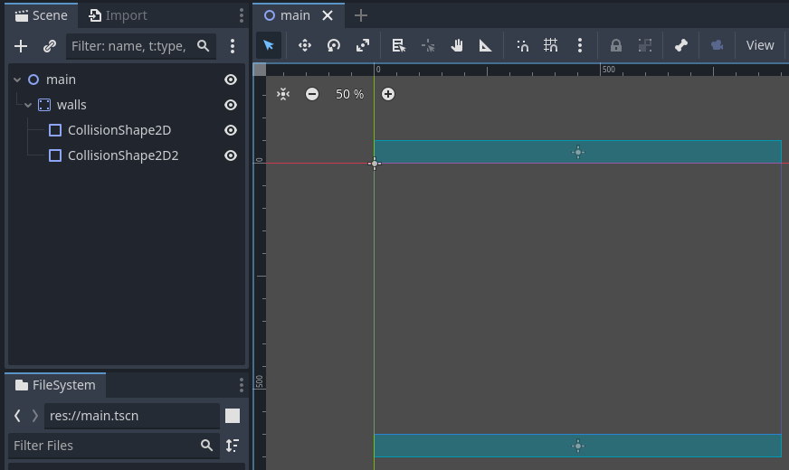

_Updated 19-Mar-2025._

# Pong

Different from Godot's [Pong example](https://github.com/godotengine/godot-demo-projects/tree/master/2d/pong), this tutorial use its physics engine. You will see the three `PhysicsBody2D` in action, and how `collision_layer` plus `collision_mask` work.

Full source of this project.


## Create the project and entry-point

Open the engine, click the **Create** button, enter the name you want for your project. At **Renderer**, pick your rendering infratructure. The options are explained in the editor. **Version Control Metadata** give you a `.git` folder, aka. initialize a VCS for you.

Hit **Create & Edit** once you're done.


### Create an entry-point

Scenes are a Godot game main components. An entry-point of a Godot game is also a "scene" file, where everything start.

Right-click on an empty part of the **File System** tab, pick **New Scene...**, name it `Main1` (or any name you want). Double-click the new scene. The **Scene** tab will display your `Main1` scene. Right-click the new scene and pick **Set as Main Scene**. Notice the scene has changed color to blue. Your scene also has a `Main1` node.

This will be ours entry-point to start programing.


## Add top and bottom walls

Traditionally, a pong game will have a top and bottom walls to bounce the ball back to the playing field. Since we are using the engine's physics, add a `StaticBody2D` named `Walls` with two top and bottom `CollisionShape2D`s. Use `RectangleShape2D` for both `CollisionShape2D` `shape` on the **Inspector** tab. Resize the `RectangleShape2D`s to fit off-sceeen (the blue lines represent what the players can see).

> `StaticBody2D` are physics objects that do not move at all, like walls and floors, but other physics objects can "interact" with. The two `CollisionShape2D` of this `Walls` contain data on where the `StaticBody2D` can be collided with. 




## Add paddles
Add a paddle that two players can control.

At **Project** > **Project Settings...** > **Input Map** tab, add some "input action" for the players to move. Wire them to the desired physical keys on you keyboard.


From the `Main1` node, add two `CharacterBody2D` with perspective `Polygon2D` for sprite and a `CollisionShape2D` for collision. Rename to `Paddle_P1` and `Paddle_P2`. 

While selecting `Polygon2D`, click four points on the editor to make a rectangle. Change the `color` to your liking.

Use `RectangleShape2D` for both `CollisionShape2D` `shape` on the **Inspector** tab. Resize the `Polygon2D`s and `RectangleShape2D`s to fit as paddles.

> `CharacterBody2D` are physics objects with user input, intended for... characters. Heavily customized for platformer games, they move by setting the `velocity` and then call `move_and_slide`.


Click both paddle and click **Attach a new script to the selected node** (document icon with plus sign) button on the *Scene* tab to attach scripts to both paddle. 

```py
# paddle_p1.gd
class_name Paddle_P1 extends CharacterBody2D

func _physics_process(delta): # called every 1/60 second
	var axis = Input.get_axis("p2_up", "p2_down")
	velocity = Vector2(0, axis) * 1000
	move_and_slide()
```
```py
# paddle_p2.gd
class_name Paddle_P2 extends CharacterBody2D

func _physics_process(delta): # called every 1/60 second
	var axis = Input.get_axis("p1_up", "p1_down")
	velocity = Vector2(0, axis) * 1000
	move_and_slide()
```

`Input.get_axis` will return a float represent the player `up` and `down` input. If `up` is pressed, `axis` will return `-1`, while `down` will yield `1`. Pressing both result in a `0`. `axis` will then be used to calculate the paddle's velocity, as we put in a random speed of `1000`. Calling `move_and_slide` will take care of some complex movement of the paddle. Putting this movement logic in `_physics_process` will have it called every \`logic\` frame (default to 1/60 second).

Press the **Run Project** button on the top-right. Now you have something like this. 


## Add the ball

Add a `RigidBody2D` named `Ball` with a `Polygon2D` for sprite and a `CollisionShape2D`.

While selecting `Polygon2D`, click enough points on the editor to make a circle. Change the `color` to your liking.

Use `CircleShape2D` for the `CollisionShape2D` `shape` on the **Inspector** tab.

> `RigidBody2D` are pure physics objects, intended to be move physics-ly with `apply_impulse`.

Optionally, add an `AudioStreamPlayer2D` for when the ball collides. A simple `.wave` sfx can be made with [ChipTone](https://sfbgames.itch.io/chiptone).


Attach a script to `Ball`.

```py
# ball.gd
class_name Ball extends RigidBody2D

signal scored(player: String)
var original_position = position
@onready var boundary_left = get_viewport_rect().position.x
@onready var boundary_right = get_viewport_rect().size.x

func _integrate_forces(state):
	# if ball is out of bound...
	if position.x < boundary_left or position.x > boundary_right:
		# repostion and relaunch.
		_reset_posision_and_speed(state)
		launch_at_random_direction()
		var scorer = "p1" if position.x > boundary_left else "p2"
		scored.emit(scorer)
	# if ball touch anything...
	for i in get_contact_count():
		$AudioStreamPlayer2D.play() # play an impact sound.
		apply_impulse(state.linear_velocity * 0.15) # increase speed.
		# allow the ball to be affected by the player movement,
		# making it hard for the opponent to predict the trajectory.
		var collider_obj = state.get_contact_collider_object(i)
		if collider_obj is Paddle_P1 or collider_obj is Paddle_P2:
			var velo = collider_obj.velocity * 0.2
			apply_impulse(velo)

func _reset_posision_and_speed(state):
	state.transform = Transform2D(0, original_position)
	linear_velocity = Vector2.ZERO

func launch_at_random_direction():
	var dir = Vector2(
		randi_range(50, 10) * [-1, 1].pick_random(),
		randi_range(50, 10) * [-1, 1].pick_random())
	apply_impulse(Vector2(dir.normalized() * 300))
```


## Main game cycle


Attach a script to `Main1`. Add then add two `Label` named `Score_P1` and `Score_P2` also, to show player scores. Style the `Label`s as needed.

```py
# main_1.gd
extends Node2D

var score_p1 = 0:
	set(value):
		score_p1 = value
		$Score_P1.text = str(value)

var score_p2 = 0:
	set(value):
		score_p2 = value
		$Score_P2.text = str(value)

func _unhandled_input(event: InputEvent) -> void:
	if event.is_action_pressed("reset_game"):
		score_p1 = 0
		score_p2 = 0
		get_tree().reload_current_scene()

func _ready():
	$Ball.launch_at_random_direction()
	$Ball.scored.connect(_on_scored)

func _on_scored(p: String):
	if p == "p1":
		score_p1 += 1
	if p == "p2":
		score_p2 += 1
```

### Collision layer and Collision mask

In our setup, by default, the paddles will participate in collision too, when the paddle's `move_and_slide` is called.

This is not what we desired.


All three types of `PhysicsBody2D` we used are `StaticBody2D`, `CharacterBody2D` and `RigidBody2D`. All of them has `collision_layer` and `collision_mask` property.

`collision_layer` (`layer`) is the layer where the body is at.

`collision_mask` (`mask`) is what the body will use to decide whether if it will ignore or collide when it touch other bodies.

By default everything use layer 1.

To stop the paddle from moving sideway, we untick `1` from the paddle's `mask`. The paddles will ignore collision effect from layer `1`, but since the paddle's `layer` is still `1`, other bodies with *mask* `1` will still "one-sided collide" with/into the paddle.

> This also means the ball's `layer` can be untick, as the paddle ignore to collide with it / does not scan it.

### But now the paddles go though wall?

Since the paddles has to avoid `mask` `1`, have the walls and the paddles "collidable" by turning on the paddles `mask` `2` and the walls `layer` `2`.

> `StaticBody2D`s do not move at all, so theirs `mask` may be irrelevant.

## The end

Thanks for reading.
