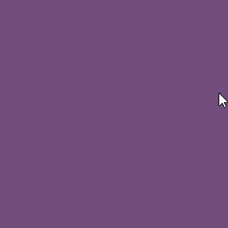
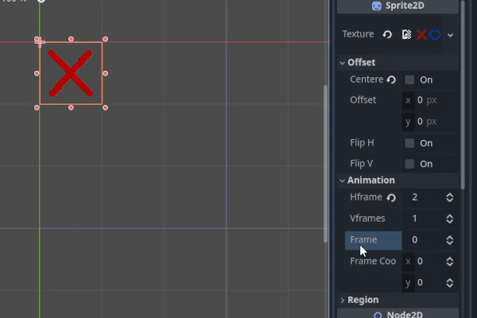
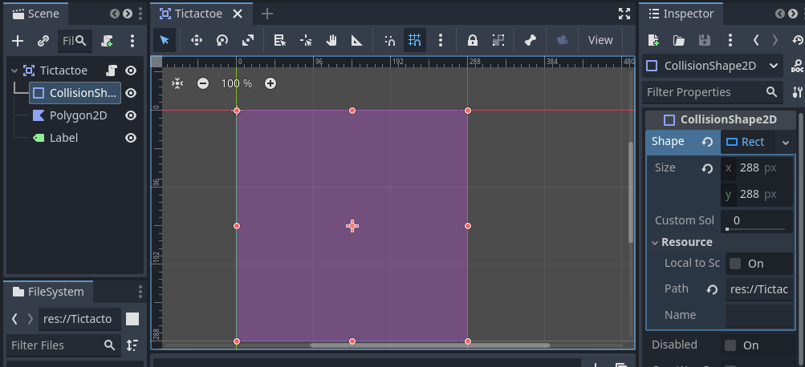

_Updated 20-Mar-2025._

# Tictactoe

Tictactoe is a game where you race to see who score a continuous line of `X` or a line of `O` first in a `3` x `3` grid.




[Source code](https://github.com/hungptsg/mini-projects/tree/main/tictactoe/src).

## The marks

Define an enum with `X` and `O`. By the default order of placement, `X` will have a value of `0` and `O` valued `1`.

```ts
enum MARKS { X, O }
```

Draw a simple sprite of these two marks. I draw them in 48x48 pixels.


Setup your mark as a `Sprite2D`. We will assign the previously defined enum as the `Sprite2D`'s `frame` to switch the sprite.



Also scale your `Sprite2D` as needed. For example my `144` x `144` field will be quite small so I have to x2 it.

## The playing field

We will use `Area2D` to pick up the player's mouse movement. And a simple `Label` to show who won.



Attach a new script to your main scene.

```py
# Tictactoe.gd

extends Area2D

enum MARKS {
	X, O
}
var mark_scene: PackedScene = load("res://Mark.tscn")
var data = [null, null, null, null, null, null, null, null, null]
var tile_size = 96
```

We will use an inner array `data` of 9 values of either `null`, `MARKS.X` or `MARKS.O` as the game matrix. The array will have the following indexes map to the matrix.

```
0   1   2
3   4   5
6   7   8
```
The first row will be `0, 1, 2`, second will be `3, 4, 5` and so on.


## Player's input


We use `_input_event` to know when the player pressed the right mouse button. 

```py
# Tictactoe.gd

# convert from pixel position to map coordinates
# eg. Vector2(88, 124) -> Vector2i(1, 2)
func local_to_map(v2: Vector2) -> Vector2i:
	return Vector2i((v2 / tile_size).floor())

# convert between map coords and array index.
# eg. Vector2i(1, 1) <-> 4
func to_coords(idx: int) -> Vector2i:
	return Vector2i(idx % 3, floori(idx / 3))

func to_array_index(coords: Vector2i) -> int:
	return coords.x + (coords.y * 3)


func _input_event(viewport: Viewport, event: InputEvent, shape_idx: int) -> void:
	if event is InputEventMouseButton:
		var mouseEvent = event as InputEventMouseButton
		if mouseEvent.pressed and mouseEvent.button_index == MOUSE_BUTTON_LEFT:
			var coords = local_to_map(mouseEvent.position)
			if (data[to_array_index(coords)] == null):
				# "draw" a mark at the location of the mouse.
				var new_mark = mark_scene.instantiate() as Sprite2D
				new_mark.frame = MARKS.X
				new_mark.position = coords * tile_size
				add_child(new_mark)
				# update inner array
				data[to_array_index(coords)] = MARKS.X
				if check_win(MARKS.X): # see below
					won("player_1") # see below
					return
				# opponent moves
				bot_make_move() # see below
				if check_win(MARKS.O): # see below
					won("bot") # see below
					return
```

> By default every input event is show as `InputEvent`. By try-casting to various type such as `InputEventMouseButton`, we have a general idea of the event. Such events will hold related data about the input device.

## Opponent make a move

We make a simple bot that will pickup a random empty position and mark it.

```py
# Tictactoe.gd

func bot_make_move():
	var array = range(0, 9)
	array.shuffle()
	for i in array:
		if data[i] == null:
			var new_mark = mark_scene.instantiate() as Sprite2D
			new_mark.frame = MARKS.O
			new_mark.position = to_coords(i) * tile_size
			add_child(new_mark)
			data[i] = MARKS.O
			return
```


## Check for winner

We check for rows and columns if the row/column is a continuous line of mark. 
```
column       diagonal line
|           /
v         /
0   1   2   <- row
3   4   5
6   7   8
```

```py
# Tictactoe.gd

func check_win(mark):
	for i in 3:
		# rows
		if data[i * 3] == mark and data[i * 3 + 1] == mark and data[i * 3 + 2] == mark:
			return true
		# columns
		if data[i] == mark and data[i + 3] == mark and data[i + 6] == mark:
			return true
	# diagonals 
	if data[0] == mark and data[4] == mark and data[8] == mark:
		return true
	if data[2] == mark and data[4] == mark and data[6] == mark:
		return true
	pass

# a simple mechanism to notify winner.
func won(player):
	$Label.text = player + " won!"
	input_pickable = false
```


## The end

Thanks for reading.
